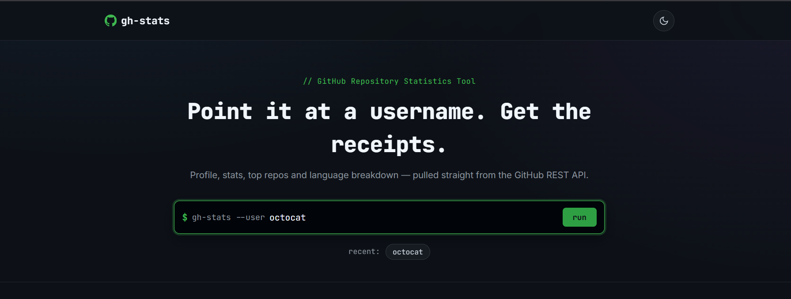
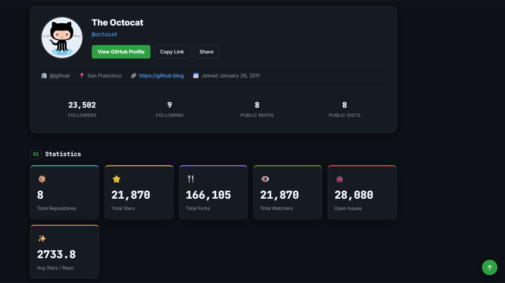

# GitHub Repository Statistics Tool

A single-page tool that looks up any public GitHub username and shows their profile, repository statistics, and top starred repositories — built with plain HTML, CSS, and vanilla JavaScript. No frameworks, no build step, no backend.

🔗 **Live Demo:** [dilkhushchoudhary.github.io/github-repository-statistics-tool](https://dilkhushchoudhary.github.io/github-repository-statistics-tool/)

## Features

- **Profile Card** — avatar, bio, company, location, blog, join date, and follower/following/repo/gist counts, with view/copy/share buttons
- **Statistics Cards** — total repos, stars, forks, watchers, open issues, and average stars/repo with animated count-up
- **Top Repositories** — top 5 most-starred repos with language, stars, forks, and last-updated date
- **Search History** — last 5 searched usernames saved locally as clickable chips
- **Dark / Light Theme** toggle, persisted locally
- **Error Handling** for empty input, 404s, rate limits, and network failures
- **Responsive Design** down to mobile widths

## Technologies Used

HTML5 · CSS3 (custom properties, Flexbox, Grid) · Vanilla JavaScript (ES6+) · [GitHub REST API](https://docs.github.com/en/rest)

## How to Run

1. Download or clone this folder
2. Open `index.html` in any modern browser

No build step, no `npm install`, no server required.

## Screenshots

### Home

### Profile & Statistics

### Top Repositories

## Folder Structure
github-stats/
├── index.html
├── style.css
├── script.js
└── README.md

## License
Released under the [MIT License](https://opensource.org/licenses/MIT).
---

Built with HTML, CSS & Vanilla JavaScript · Developed by **Dilkhush Choudhary**
